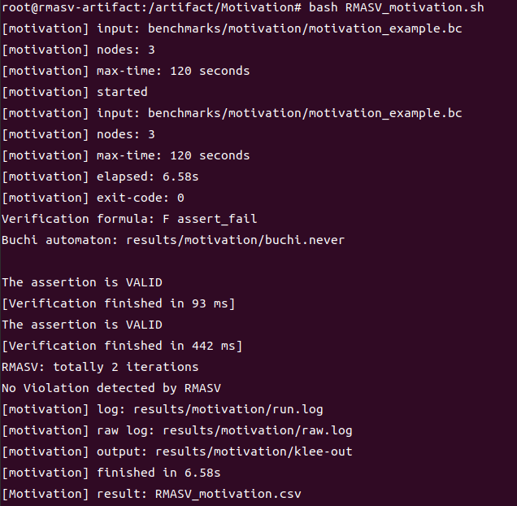
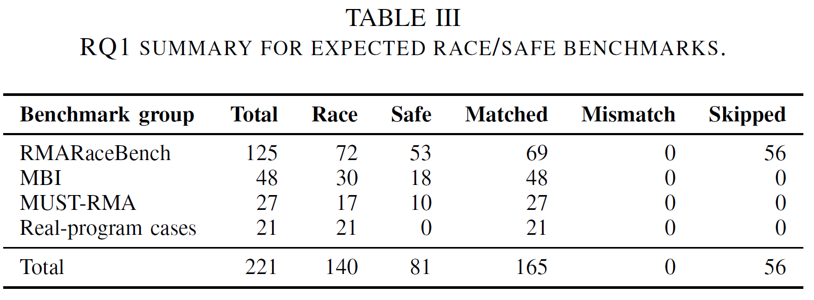
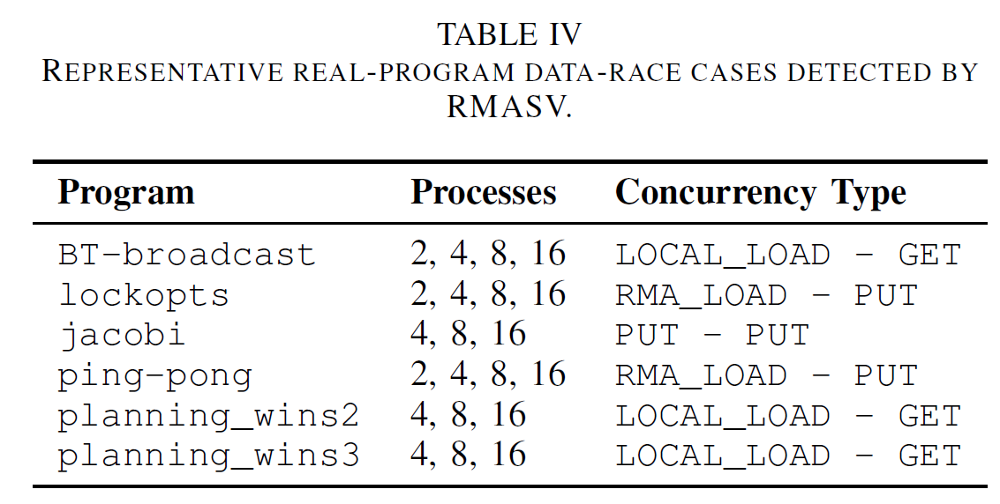
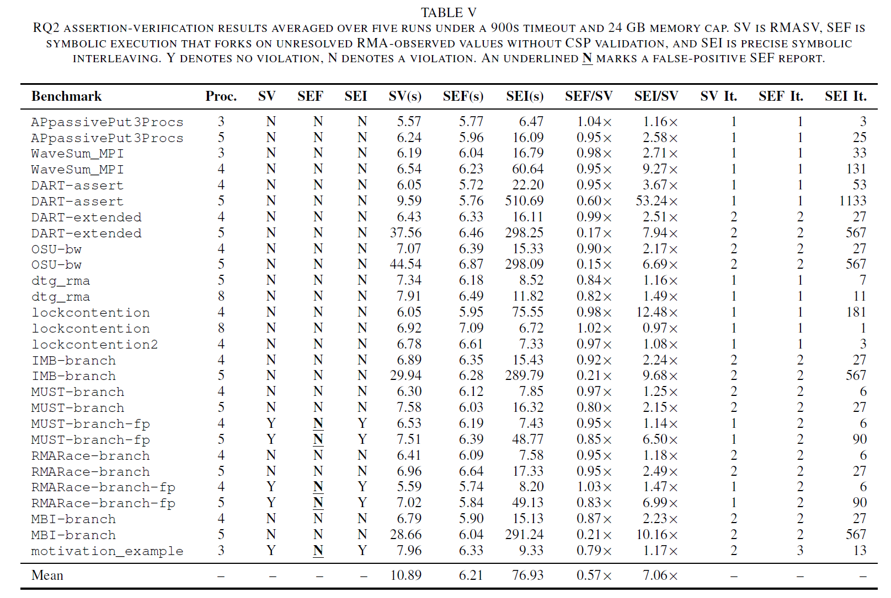
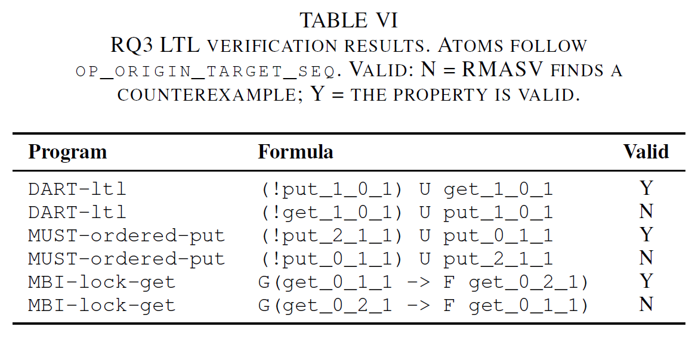

# RMASV Artifact

This is the artifact of **Symbolic Verification of Message Passing Interface Programs with Remote Memory Access** in ICSE2027.

RMASV is a symbolic-verification tool for MPI one-sided communication. It records RMA communication events during symbolic execution, builds a CSP model for legal RMA interleavings, and uses the model to check data races, assertions, and LTL properties. This artifact provides a prebuilt Docker image containing the RMASV executable, runtime libraries, sanitized benchmark inputs, and reproduction scripts.

## Requirements

- Linux host with Docker installed
- At least 32 GB memory recommended
- At least 50 GB free disk space recommended

The full experiments may take a long time. Quick scripts are provided for checking the environment and inspecting representative results first.

## Evaluation Setup

RMASV analyzes MPI C programs compiled to LLVM bitcode. The artifact image contains the prebuilt RMASV executable, its runtime libraries, and sanitized benchmark bitcode; reviewers do not need to compile the source code. The scripts use the default evaluation settings encoded in the artifact.

The experiments use a per-case timeout of 600 seconds for RQ1/RQ3 and 900 seconds for RQ2. The paper reports RQ2 means over five repeated runs; the artifact scripts run one reproduction round by default so that reviewers can inspect the complete workflow without repeating the full suite five times.

## Getting the Artifact

Pull the Docker image:

```bash
docker pull mpirma/rmasv:latest
```

Start an interactive shell:

```bash
docker run --rm -it mpirma/rmasv:latest
```

The container starts in the artifact root directory. The top-level directories include:

```text
Motivation  RQ1  RQ2  RQ3  benchmarks  scripts  tool  runtime
```

When `--rm` is used, generated files are removed when the container exits. To keep the results outside the container, mount an output directory:

```bash
docker run --rm -it -v "$PWD/results:/artifact/results" mpirma/rmasv:latest
```

## Quick Functional Check

Run a short end-to-end check:

```bash
cd /artifact
bash scripts/run_all_quick.sh
```

This runs the motivating example, a representative subset of RQ1/RQ2, and RQ3.

## Motivating Example

This example is the small RMA-dependent assertion case used to illustrate why RMASV defers RMA-interleaving reasoning to the CSP model checker. The program has three MPI ranks and a shared-window-dependent assertion. The script runs the same SV/RMASV configuration used in the paper's motivating discussion.

Run the motivating example:

```bash
cd /artifact/Motivation
bash RMASV_motivation.sh
cat RMASV_motivation.csv
```

The script writes:

```text
Motivation/RMASV_motivation.csv
```

Screenshot placeholder:



## RQ1: RMA Data-Race Detection

RQ1 evaluates whether RMASV reports the expected RMA data-race outcomes on representative MPI-RMA patterns. The artifact includes the representative real-program cases used for this reproduction package, including one-sided broadcast, lock-contention, ping-pong, and planning-window kernels at the process counts encoded in the scripts. RQ1 uses the SV/RMASV mode only.

Run a quick representative subset:

```bash
cd /artifact/RQ1
bash RMASV_result_quick.sh
cat RMASV_result_quick.csv
```

Run the full RQ1 experiment:

```bash
cd /artifact/RQ1
bash RMASV_result.sh
cat RMASV_result.csv
```

The CSV contains the benchmark label, process count, verification result, exit code, runtime, iteration count, and paths to detailed logs.





## RQ2: Assertion Verification

RQ2 evaluates assertion verification over RMA programs with shared-window-dependent assertions and branches. The benchmark group includes the motivating example, DART-style `Get`/`Put` writeback cases, passive-target MUST-style cases, WaveSum and lock-contention kernels, OSU `put_bw`-derived cases, and branch-sensitive cases derived from IMB, MUST, RMARaceBench, and MBI patterns.

RQ2 compares three configurations:

- `SV`: RMASV with CSP-guided multi-control-flow verification.
- `SEF`: shared-value forking without CSP verification.
- `SEI`: symbolic RMA interleaving without CSP verification.

Run a quick representative subset:

```bash
cd /artifact/RQ2
bash RMASV_result_quick.sh
cat RMASV_result_quick.csv
```

Run the full RQ2 experiment:

```bash
cd /artifact/RQ2
bash RMASV_result.sh
cat RMASV_result.csv
```

The generated CSV reports the mode (`SV`, `SEF`, or `SEI`), benchmark label, process count, result, runtime, and iteration count.

The full RQ2 run is substantially longer than the quick script because it runs all RQ2 benchmarks once under all three modes. Based on our evaluation runs, a complete RQ2 run is expected to take roughly 45--60 minutes on a typical desktop or workstation; slower machines, constrained Docker settings, or emulated execution may take longer. In the worst case, the runtime is bounded by the per-case timeout configured in the artifact scripts. We recommend running `RMASV_result_quick.sh` first to confirm the environment before starting the full RQ2 run.



## RQ3: LTL Property Verification

RQ3 evaluates RMASV's LTL checking over the generated CSP model. The artifact includes six properties over three representative RMA programs: a DART-style `Get`/`Put` update, a MUST passive-target ordering case, and an MBI locked-`Get` case. For each program, one property is expected to hold and one property is expected to be violated.

Run the RQ3 experiment:

```bash
cd /artifact/RQ3
bash RMASV_result.sh
cat RMASV_result.csv
```

The generated CSV reports each LTL property, the expected verification outcome, the observed result, runtime, and log paths.




## Full Reproduction

Run all full experiments:

```bash
cd /artifact
bash scripts/run_all_full.sh
```

For a shorter check:

```bash
cd /artifact
bash scripts/run_all_quick.sh
```

The full run is expected to take substantially longer than the quick run.

## Output Files

Each RQ directory copies its final CSV into the current directory:

```text
Motivation/RMASV_motivation.csv
RQ1/RMASV_result.csv
RQ2/RMASV_result.csv
RQ3/RMASV_result.csv
```

Detailed per-case logs are stored under `results/`. Each CSV row includes the corresponding `run.log` and `raw.log` paths.

## Troubleshooting

If a full experiment takes too long, run the corresponding quick script first.

If a script fails, inspect the `run.log` and `raw.log` paths listed in the generated CSV.

Timing may vary across machines; small runtime differences are expected.
